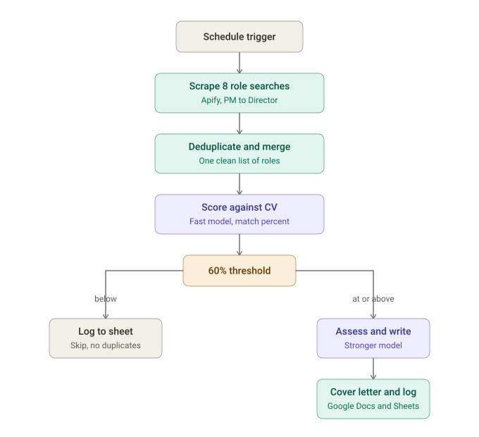

# Job application automation

An n8n workflow I built to run my own job search as a system rather than a to-do list. It scrapes new roles across eight search profiles every day, scores each one against my CV with an AI model, and for anything that clears a match threshold it drafts a tailored cover letter and logs the application, all without me touching a spreadsheet.

I built this while job hunting after a redundancy. The problem was familiar to anyone who has run a serious search: high volume, repetitive triage, and constant risk of duplicated effort or missed roles. Rather than grind through it manually, I treated it as a delivery problem and built a pipeline to handle it.

## What it does

Every run, the workflow:

1. Searches eight role profiles in parallel (Project Manager, Programme Manager, PMO, Chief of Staff, Operations Manager, Director, Delivery, and Operations Generalist) using Apify scrapers.
2. Deduplicates and merges the results into a single clean list, so the same role scraped by two searches is only processed once.
3. Scores each role against my CV using a fast, low-cost AI model, producing a match percentage.
4. Gates on a 60% threshold. Roles below it are logged and skipped so they are never reprocessed. Roles at or above it move on.
5. Runs a stronger AI model over the qualifying roles to produce a detailed assessment and a tailored cover letter, written straight into Google Docs.
6. Logs everything to Google Sheets, with separate tracking for applications, processed roles, and rejections.

## Pipeline

## The design decision worth noting

The pipeline uses two AI models on. A cheaper, faster model does the first-pass scoring across every scraped role, which is high volume and does not need deep reasoning. Only roles that clear the 60% threshold are handed to a more capable, more expensive model for the assessment and cover-letter writing, which is where quality actually matters.

The split is a deliberate cost-and-quality tradeoff: spend the cheap model's time on triage where volume is high and stakes are low, and reserve the expensive model for the small number of roles where the output has to be good. The 60% gate is the control, it also prevents duplicated effort as nothing already seen gets processed twice.

## Built with

- **n8n** for orchestration
- **Apify** for role scraping
- **Anthropic (Claude)** for scoring, assessment, and cover-letter generation
- **Google Docs and Google Sheets** for output and tracking

## Running it yourself

The workflow file in this repo (`Application_Automation.sanitised.json`) is a sanitised export. All personal details, private document IDs, and credentials have been replaced with clear placeholders, so it will not run as-is. To adapt it:

1. Import the JSON into your own n8n instance.
2. Connect your own credentials for Apify, Anthropic, and Google (n8n does not import secrets, so you add these yourself).
3. Replace the placeholders: `YOUR_GOOGLE_SHEET_ID`, `YOUR_GOOGLE_DOC_TEMPLATE_ID`, and the personal profile fields inside the AI prompt nodes (name, location, and your own target criteria).
4. Adjust the eight search profiles and the 60% threshold to match what you are looking for.

## A note on scope

This was built to solve a real problem I had at a specific moment. It is shared here as a worked example of how I approach delivery: find the repetitive, error-prone part of a process, design a system that removes it, and build in the controls that keep the output trustworthy. The workflow is fully functional and could run again with fresh credentials, though I am not running it live.
